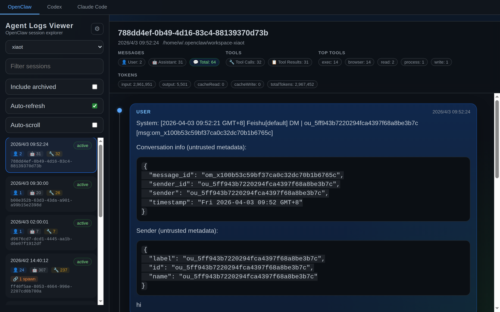
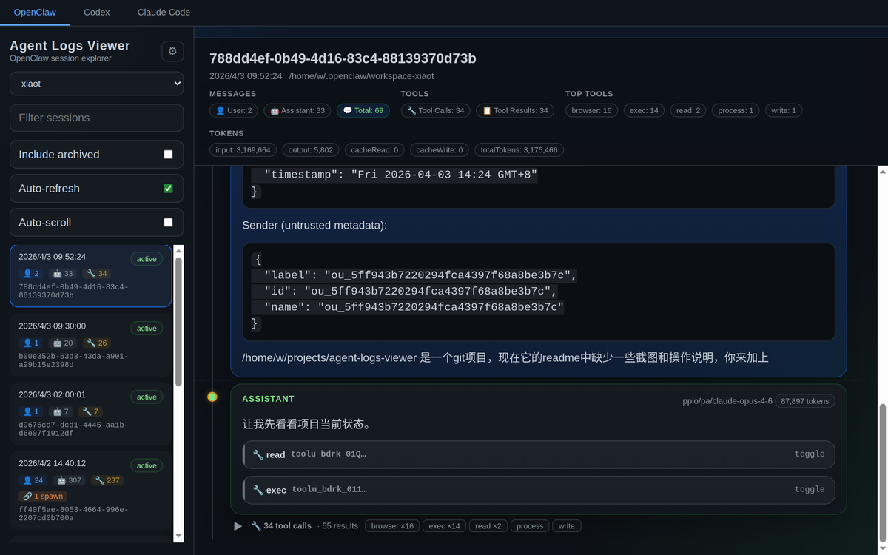
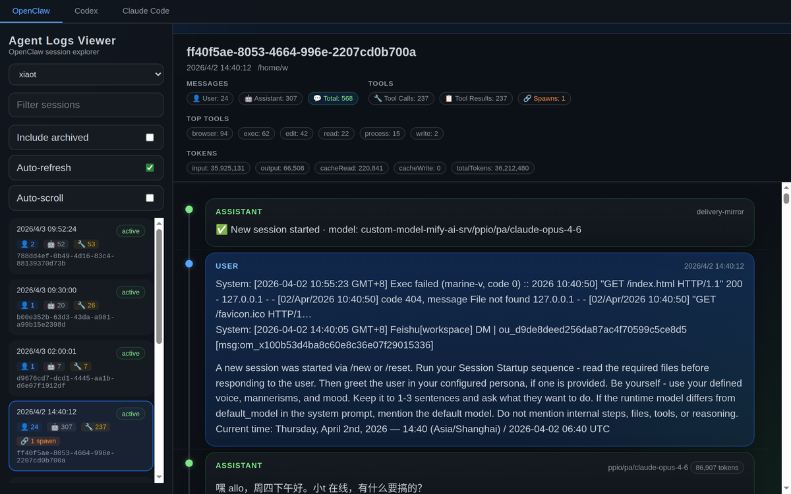
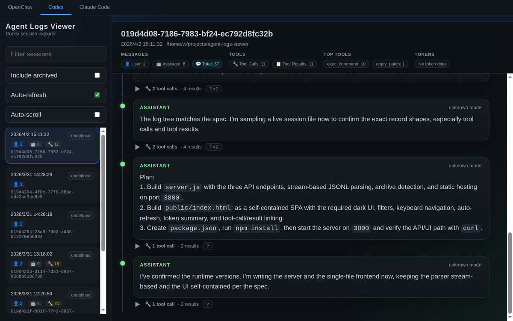
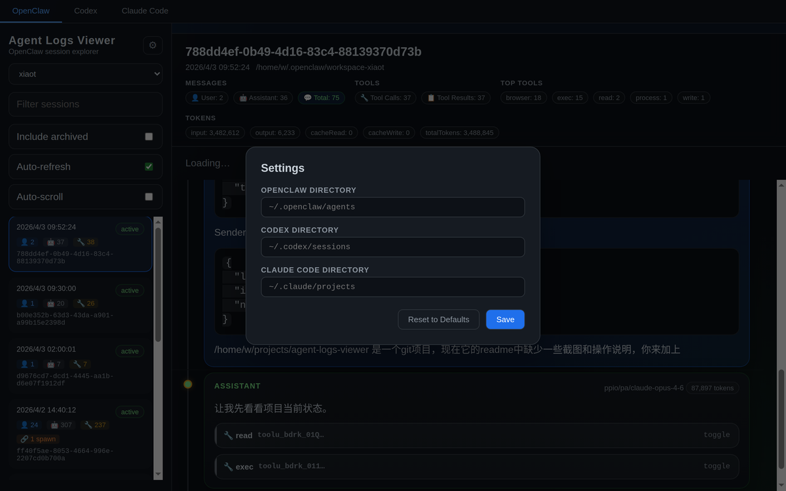

# AgentXRay

**AgentXRay** is a local-first web dashboard that reads and visualizes the session logs your AI coding agents already write to disk, for developers who want to see what those agents actually did.

<p align="center">
  
</p>

<p align="center">
  <strong><a href="https://alloevil.github.io/AgentXRay/">Live Demo</a></strong> (synthetic sample data)
</p>

<p align="center">
  
  <a href="https://github.com/alloevil/AgentXRay/actions/workflows/test.yml"></a>
  <a href="https://scorecard.dev/viewer/?uri=github.com/alloevil/AgentXRay"></a>
  <a href="https://github.com/alloevil/AgentXRay/releases/latest"></a>
  
  
  
  
</p>

<p align="center">
  <a href="#install">Install</a> ·
  <a href="#features">Features</a> ·
  <a href="#screenshots">Screenshots</a> ·
  <a href="#api">API</a> ·
  <a href="README.zh-CN.md">中文</a>
</p>

---

## What it is

X-ray vision into your AI agent sessions. Supports **OpenClaw**, **Codex**, **Claude Code**, **Hermes**, **OMP**, **DeepSeek Harness** and **Gemini CLI** — all in one interface.

AgentXRay is a single Node.js + Express server plus a React UI. It reads the JSONL session logs (SQLite, for Hermes) that those CLIs already write under your home directory and normalizes all seven formats into one view: tool calls paired with their results, tokens and cost summed per user turn, per-turn trace waterfalls, prompt extraction and cross-platform full-text search. Nothing is instrumented, and nothing leaves your machine.

## Why AgentXRay

AgentXRay is a **local-first viewer for the agent sessions you already have**.

Observability platforms like LangSmith and Langfuse are built for agents *you* write: you add their SDK, instrument your code, and traces stream to a hosted backend. Great for building your own agent — but CLI coding agents (Claude Code, Codex, Gemini CLI, …) aren't your code to instrument. They already write complete session logs to your disk; AgentXRay just reads them. Zero integration, zero config, nothing leaves your machine.

Compared to grepping the raw JSONL yourself, AgentXRay normalizes seven different log formats into one interface: tool calls paired with their results, token usage summed per session, full-text search across every platform at once, prompt extraction, and trace timelines — things that are tedious to reconstruct by hand from a 50MB session log.

If you build and operate your own agent in production, use a tracing platform. If you want to see what your coding agents actually did, use AgentXRay.

## When to use it

- You use one or more CLI coding agents and want to review what a session actually did — which tools ran, with what arguments, what came back, where the time and tokens went.
- You want token and cost accounting per user turn for sessions that have already finished, without having instrumented anything beforehand.
- You need to search across every agent platform at once, including prompts recoverable from sessions Claude Code's own cleanup already deleted.
- You want your session data to stay on your machine: no SDK, no account, no egress.
- You want to collect the prompts worth keeping and install them as native slash commands for Claude Code, Codex or OMP.

## When NOT to use it

- **You are building your own agent and want production tracing.** Use an observability platform instead. AgentXRay reads finished log files; it is not an instrumentation SDK and has no hosted backend, retention policy, alerting or team dashboard.
- **You need a multi-user or remotely hosted service.** It is a single-process local server, meant to run on the machine that owns the logs.
- **Your agent does not write session logs in a supported format.** Only the seven adapters registered in `lib/platforms/index.js` are supported; anything else needs a new adapter (see [Development](#development)).
- **You cannot run Node.js ≥ 22.13**, or you need compressed DeepSeek Harness logs on a Node older than 22.15.
- **You want the legacy vanilla UI under `public/` to gain features.** It is frozen and receives security fixes only.
- **You expect the LLM-powered prompt rewriting to work with no setup.** It needs an OpenAI-compatible endpoint configured in Settings → LLM 接口, or the `claude` CLI on the server's PATH; without one, clustering and attribution still work but rewriting returns HTTP 503.

## Compared to LangSmith and Langfuse

| | AgentXRay | LangSmith / Langfuse |
|---|---|---|
| Built for | agent sessions you already have on disk | agents you write yourself |
| Integration | none — reads existing log files | add their SDK and instrument your code |
| Works with off-the-shelf CLI agents (Claude Code, Codex, Gemini CLI) | yes, they already log to disk | not their model — that code is not yours to instrument |
| Where data lives | your machine only | hosted backend |

Rule of thumb: if you build and operate your own agent in production, use a tracing platform. If you want to see what your coding agents actually did, use AgentXRay. LangSmith and Langfuse are the only alternatives this project makes any comparison against.

---

## Features

- **Per-turn ledger** — In the session summary: one row per user turn with wall-clock time, tokens (input + output + cache) and cost, bars scaled to the session maximum, tool-call and error counts, click to jump. Answers "why did this take 40 minutes / cost $3" without reading the transcript.
- **Multi-platform** — Unified view across OpenClaw, Codex, Claude Code, Hermes, OMP, DeepSeek Harness and Gemini CLI sessions (dsh's multi-frame zstd session logs are decompressed transparently; Gemini CLI's `/rewind` checkpoints are folded so rewound history never renders twice)
- **Session browser** — Browse agents, filter/search sessions, view message history
- **Tool call inspection** — Expandable tool calls with arguments and results
- **Trace view** — Per-turn waterfall of where the time went: model inference (blue) vs tool execution (green, red on error); click any bar to jump to that message
- **Prompt extraction** — See every real human prompt per session (tool results, slash commands and injected noise filtered out), grouped by working directory, with search / JSON export / copy
- **Prompt optimization** — Cluster prompts into templates, attribute session outcomes (turns, tool calls, error rate) per template, and get LLM-powered rewrite suggestions — through any OpenAI-compatible endpoint (Settings → LLM 接口) or, if none is configured, the local `claude` CLI
- **Prompt library** — Curate the prompts worth keeping into `~/.agentxray/library`, tag / edit / search them, then install any of them as a native slash command for Claude Code, Codex or OMP with one click — `$ARGUMENTS` is passed through, so `/name some args` works in the target CLI
- **Global search** — One search box across all seven platforms at once, multi-keyword AND matching, colored platform badges per hit — including prompts recovered from sessions that Claude Code's cleanup already deleted
- **Session insights** — Aggregate analytics dashboard with tool stats, error clustering and daily trends
- **Spawn tracking** — Detect and navigate parent/child agent relationships
- **OMP sub-agents** — Sub-agents spawned by an OMP session show up as chips in the summary; click one to read the child agent's full transcript
- **Message timeline** — Visual graph showing conversation flow with role indicators
- **Resume command** — One click copies the exact command to resume a session in its own CLI (`codex resume`, `claude --resume`, `omp --resume=`)
- **Collapsible summary** — Fold the session summary away when you want the full height for messages
- **Auto-refresh** — Live-updating session list and messages
- **Settings panel** — Configure platform directories from the UI, persisted in localStorage
- **Session backup** — Incremental archive of your session logs into `~/.agentxray/archive`, one click in settings (also runs automatically, daily); unchanged files are skipped
- **Keyboard navigation** — Arrow keys to move between sessions

---

## Screenshots

### Session Browser

Browse agents and sessions in the sidebar. Each session card shows message counts by role (👤 User, 🤖 Assistant, 🔧 Tool) and spawn indicators. The main panel displays session metadata, token usage, and top tools at a glance.



### Tool Call Inspection

Expand any tool call to see its arguments and result. Collapsed groups show tool type counts for quick scanning.



### Spawn Tracking

Sessions that spawn sub-agents are marked with a 🔗 badge. Click to navigate the parent/child relationship chain.



### Multi-Platform Support

Switch between OpenClaw, Codex, Claude Code, Hermes, OMP, DeepSeek Harness and Gemini CLI with one click. Each platform's sessions are parsed from their native log format.



### Settings

Configure platform directories from the UI. Changes are saved to localStorage — no server restart needed.



---

## Install

**Option 1 — npx from npm**

```bash
npx @alloevil/agent-xray            # default http://localhost:3800
npx @alloevil/agent-xray --port 3900 --host 127.0.0.1
```

A global install (`npm i -g @alloevil/agent-xray`) exposes the same launcher as `agentxray`.

**Option 2 — npx straight from GitHub** (works today, no clone)

```bash
npx github:alloevil/AgentXRay
```

The first run builds the web UI locally (takes a minute); later runs reuse the cached install.

**Option 3 — from source**

```bash
git clone https://github.com/alloevil/AgentXRay.git
cd AgentXRay
npm install               # also builds the web UI on first install
npm start
```

Open http://localhost:3800

---

## Usage

### Basic Workflow

1. **Select a platform** — Click `OpenClaw`, `Codex`, `Claude Code`, `Hermes`, `OMP`, `DeepSeek Harness`, or `Gemini CLI` in the top bar
2. **Pick an agent** — For OpenClaw, choose an agent from the dropdown (e.g. `xiaot`, `mimo`)
3. **Browse sessions** — Sessions are sorted by date, newest first. Each card shows:
   - Timestamp and status (`active` / `archived`)
   - Message counts: 👤 User, 🤖 Assistant, 🔧 Tool calls
   - 🔗 Spawn badge if the session spawned sub-agents
4. **View messages** — Click a session to load its full conversation
5. **Inspect tool calls** — Click any `🔧 tool_name` button to expand arguments/results
6. **Navigate spawns** — Click the 🔗 link to jump to the spawned child session

### Prompt View

Click the **Prompts** tab (next to Sessions / Insights) to see every real human prompt across all sessions, grouped by the session's working directory. Noise like tool results, slash-command echoes, system reminders and task notifications is filtered out.

- **Preview & expand** — Each session row shows a one-line preview of its first prompt; click to expand the full markdown-rendered prompt list
- **Search** — Filter prompts / directories / sessions live
- **Export JSON** — Download all extracted prompts for offline processing
- **分析优化 (Analyze)** — Cluster prompts into templates, attribute session outcomes (avg turns, tool calls, error rate) per template, and get rewrite suggestions from Claude. Requires the [`claude` CLI](https://claude.com/claude-code) on the server's PATH; without it the clustering and attribution table still works
- **优化 (Optimize)** — Hover any single prompt and click 优化 for an inline LLM-powered rewrite (configure the backend in Settings → LLM 接口, or have the `claude` CLI on PATH)

### Keyboard Shortcuts

| Key | Action |
|-----|--------|
| `↑` / `↓` | Move between sessions |
| `Enter` | Select highlighted session |

### Filtering & Search

- **Search box** — Filter sessions by ID or content
- **Include archived** — Toggle to show/hide archived (`.reset.*` / `.deleted.*`) sessions
- **Auto-refresh** — Automatically poll for new sessions and messages
- **Auto-scroll** — Scroll to the latest message when new content arrives

---

## Configuration

### Default directories

| Platform    | Default path                  |
|-------------|-------------------------------|
| OpenClaw    | `~/.openclaw/agents`          |
| Codex       | `~/.codex/sessions`           |
| Claude Code | `~/.claude/projects`          |
| Hermes      | `~/.hermes`                   |
| OMP         | `~/.omp/agent/sessions`       |
| DeepSeek Harness | `~/.dsh/sessions` (honors `DSH_HOME`) |
| Gemini CLI  | `~/.gemini/tmp`               |

### Custom directories

**Via UI:** Click the gear icon in the sidebar to set custom paths per platform. Saved to localStorage, no restart needed.

**Via environment variables:**

```bash
OPENCLAW_DIR=/custom/path/openclaw \
CODEX_DIR=/custom/path/codex \
CLAUDE_CODE_DIR=/custom/path/claude \
HERMES_DIR=/custom/path/hermes \
OMP_DIR=/custom/path/omp \
DSH_DIR=/custom/path/dsh/sessions \
GEMINI_DIR=/custom/path/gemini/tmp \
npm start
```

**Via API:** Pass `?dir=/absolute/path` query parameter to any API endpoint.

---

## API

| Endpoint | Description |
|----------|-------------|
| `GET /api/agents` | List OpenClaw agents |
| `GET /api/agents/:name/sessions` | List sessions for an agent |
| `GET /api/agents/:name/sessions/:id` | Get session messages |
| `GET /api/codex/sessions` | List Codex sessions |
| `GET /api/codex/sessions/:id` | Get Codex session messages |
| `GET /api/claude-code/sessions` | List Claude Code sessions |
| `GET /api/claude-code/sessions/:id` | Get Claude Code session messages |
| `GET /api/hermes/sessions` | List Hermes sessions |
| `GET /api/hermes/sessions/:id` | Get Hermes session messages |
| `GET /api/omp/sessions` | List OMP (oh-my-pi) sessions |
| `GET /api/omp/sessions/:id` | Get OMP session messages |
| `GET /api/dsh/sessions` | List DeepSeek Harness sessions |
| `GET /api/dsh/sessions/:id` | Get DeepSeek Harness session messages |
| `GET /api/gemini/sessions` | List Gemini CLI sessions |
| `GET /api/gemini/sessions/:id` | Get Gemini CLI session messages |
| `GET /api/spawn-map` | Build agent spawn relationship map |
| `GET /api/insights` | Aggregate analytics (tool stats, error clusters, trends) |
| `GET /api/prompts` | Real human prompts per session, grouped by directory |
| `GET /api/prompts/analyze` | Template clustering + attribution + Claude suggestions (`?refresh=1` to recompute, `?skipLlm=1` for clustering only) |
| `POST /api/prompts/rewrite` | Rewrite a single prompt via the configured LLM backend (`{ "text": "..." }`; 503 with guidance when no backend is available) |
| `GET/PUT /api/settings/llm` | LLM backend config: OpenAI-compatible `baseUrl`/`model`/`apiKey`, persisted in `~/.agentxray/llm.json` (key never echoed back) |
| `GET /api/search` | Full-text search across sessions (`?platform=all` searches every platform at once, multi-keyword AND) |
| `GET /api/omp/sessions/:id/children` | List sub-agents spawned by an OMP session |
| `GET /api/omp/sessions/:id/children/:name` | Get a spawned sub-agent's messages |
| `GET /api/library` | List library prompts with their per-target install state |
| `POST /api/library` | Create a prompt (`{ "name": "...", "content": "...", "description": "...", "tags": [...] }`) |
| `PUT /api/library/:name` | Update / rename a prompt (`newName`, `content`, `description`, `tags`); installed copies are refreshed |
| `DELETE /api/library/:name` | Delete a prompt and any installed slash commands |
| `POST /api/library/:name/install` | Install as a slash command (`{ "targets": ["claude", "codex", "omp"] }`) |
| `POST /api/library/:name/uninstall` | Remove the installed slash commands (same body) |
| `POST /api/library/suggest-name` | Suggest a library name for a prompt via the configured LLM backend (`{ "text": "..." }`; `null` when no backend is available) |
| `POST /api/backup` | Run an incremental backup into `~/.agentxray/archive` |
| `GET /api/backup/status` | Archive stats: file count, total bytes, last backup time |

All list/detail endpoints accept an optional `?dir=` parameter to override the default directory.

---

## Tech Stack

- **Backend:** Node.js + Express
- **Frontend:** React + Vite + TypeScript under `frontend/` (default UI, served from `frontend/dist`)
- **Legacy UI:** the original vanilla HTML/CSS/JS app under `public/`, served at `/legacy` — **frozen: security fixes only**. New features land in the React app exclusively; a feature change to the React renderer requires zero edits under `public/js/`. Shared logic (formatters, trace builder, markdown/escape pipeline) is authored once in `frontend/src/lib/pure.ts` and `frontend/src/lib/markdown.ts`, and `public/js/pure.js` is generated from them (`npm run build:legacy-pure`, also part of `build:ui`).
- **Data:** Reads JSONL session files directly from disk
- **Zero external CDN** — Everything is self-contained, works offline

---

## Supported Log Formats

| Platform | Format | Path Pattern |
|----------|--------|--------------|
| OpenClaw | JSONL | `~/.openclaw/agents/{agent}/sessions/{id}.jsonl` |
| Codex | JSONL | `~/.codex/sessions/{id}.jsonl` |
| Claude Code | JSONL | `~/.claude/projects/*/sessions/*/session.jsonl` |
| Hermes | SQLite | `~/.hermes/state.db` |
| OMP | JSONL | `~/.omp/agent/sessions/*/{timestamp}_{id}.jsonl` |
| DeepSeek Harness | JSONL / zstd-compressed JSONL | `~/.dsh/sessions/{project}/{id}/session.jsonl[.zstd]` |
| Gemini CLI | JSONL | `~/.gemini/tmp/{projectHash}/chats/session-*.jsonl` |

dsh's `.jsonl.zstd` logs are a concatenation of independent Zstandard frames (one per append batch); AgentXRay scans the frame boundaries and decompresses every frame, tolerating a torn trailing frame after a crash. Reading compressed dsh logs requires Node.js ≥ 22.15 (built-in zstd); plain `session.jsonl` logs work on any supported Node.

Archived sessions (`.jsonl.reset.*`, `.jsonl.deleted.*`) are also supported when "Include archived" is enabled.

---

## Development

Tests live in `test/` and use Node's built-in test runner — no extra dependencies. Run `npm ci` once, then `npm test` (`node --test test/*.test.js`). The tests start their own server on a random port with `HOME` and every platform directory pointed at a throwaway copy of `test/fixtures/home`, so your real session logs are never read or modified. CI runs the same two commands on Node 22 for every push and pull request to `master` (see `.github/workflows/test.yml`).

**Adding a platform** takes two files: write one adapter in `lib/platforms/<name>.js` (list / find / parse / normalize for that log format — `lib/platforms/shared.js` provides the metadata cache, the normalized-message factory and the session sort), then register it in the `PLATFORMS` table in `lib/platforms/index.js`. The generic session routes, search, watch (SSE tail), insights, prompts, tool audit, OTLP and Markdown/HTML export all resolve platforms through that registry — no other file needs to change.

---

## FAQ

**Which agents and log formats does AgentXRay support?**
Seven platforms: OpenClaw, Codex, Claude Code, Hermes, OMP (oh-my-pi), DeepSeek Harness and Gemini CLI. Six of them store JSONL; Hermes stores SQLite at `~/.hermes/state.db`. DeepSeek Harness logs may be multi-frame zstd-compressed `.jsonl.zstd`, which AgentXRay decompresses frame by frame, tolerating a torn trailing frame left by a crash. The authoritative list is the `PLATFORMS` registry in `lib/platforms/index.js` — run `node -e 'console.log(Object.keys(require("./lib/platforms/index.js").PLATFORMS))'` to print it.

**Does AgentXRay send my session data anywhere?**
No. It is a local Node.js server reading files from your own disk, serving a self-contained UI with zero external CDN dependencies, so it works offline. The only outbound traffic it can make is the optional prompt-rewrite feature, which calls an OpenAI-compatible endpoint you configure yourself or shells out to a local `claude` CLI; configure neither and nothing is sent anywhere.

**Do I have to change my agent or add instrumentation?**
No. CLI coding agents already write complete session logs to disk, and AgentXRay just reads them. There is no SDK to add to your code and no wrapper command to run your agent under. A default install needs no configuration either, because the default directories listed under [Configuration](#configuration) are used unless you override them in the settings panel or through environment variables such as `CLAUDE_CODE_DIR`.

**How do I try it without installing anything?**
Open <https://alloevil.github.io/AgentXRay/>. That GitHub Pages deployment is the real React UI, built by `.github/workflows/pages.yml`, running against the synthetic sample logs committed under `frontend/demo/sample-logs`. It contains no real user sessions, so treat it as a UI tour rather than as data.

**How do I add support for a log format that is not listed?**
Two files: write an adapter at `lib/platforms/<name>.js` implementing list / find / parse / normalize for that format, then register it in the `PLATFORMS` table in `lib/platforms/index.js`. Every generic route resolves platforms through that registry, so no other file needs to change. See [Development](#development).

---

## License

[MIT](LICENSE)

---

<p align="center">
  <sub>⭐ Star this repo if you find it useful!</sub>
</p>
