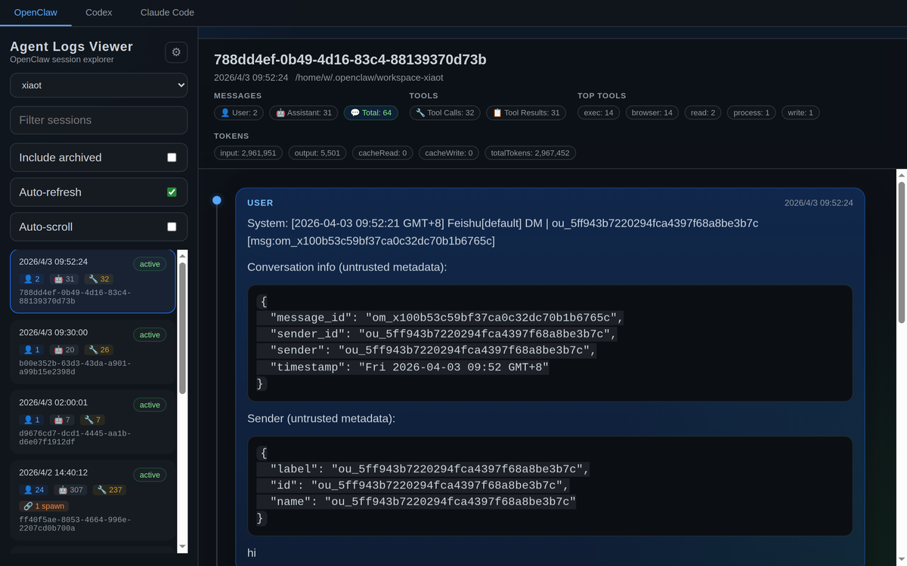
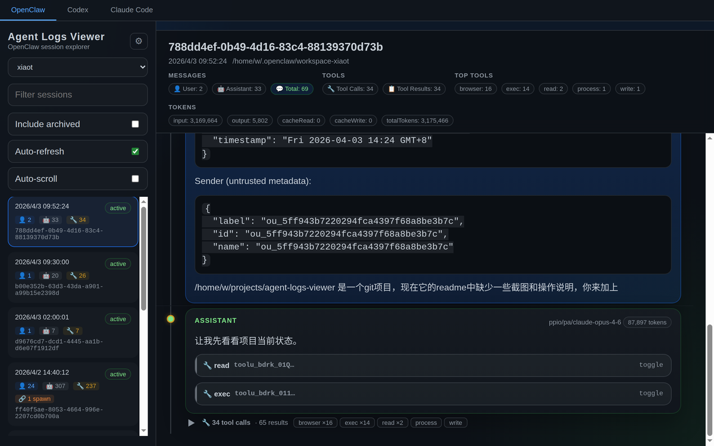
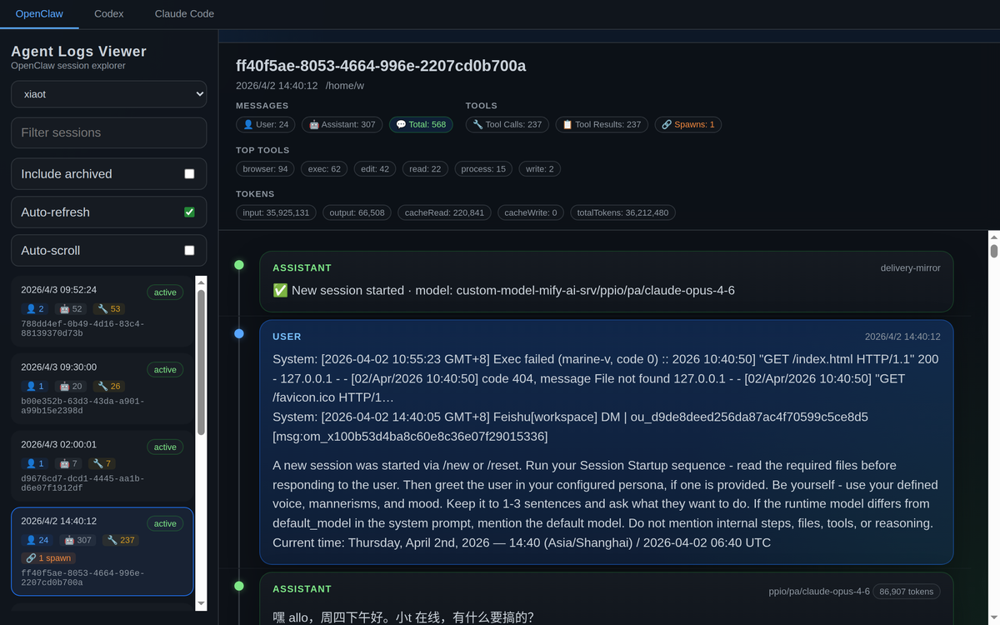
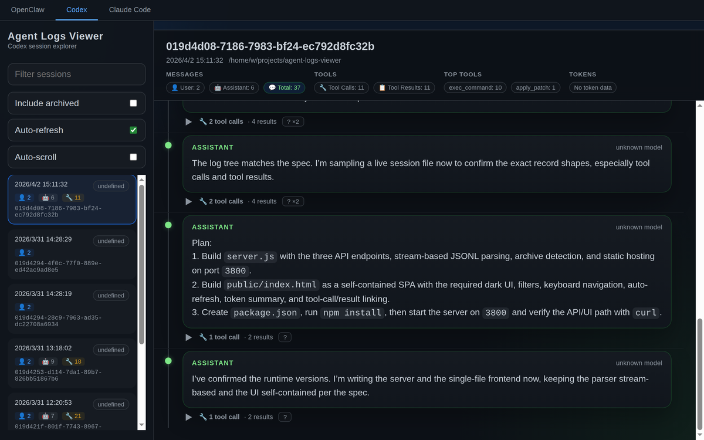
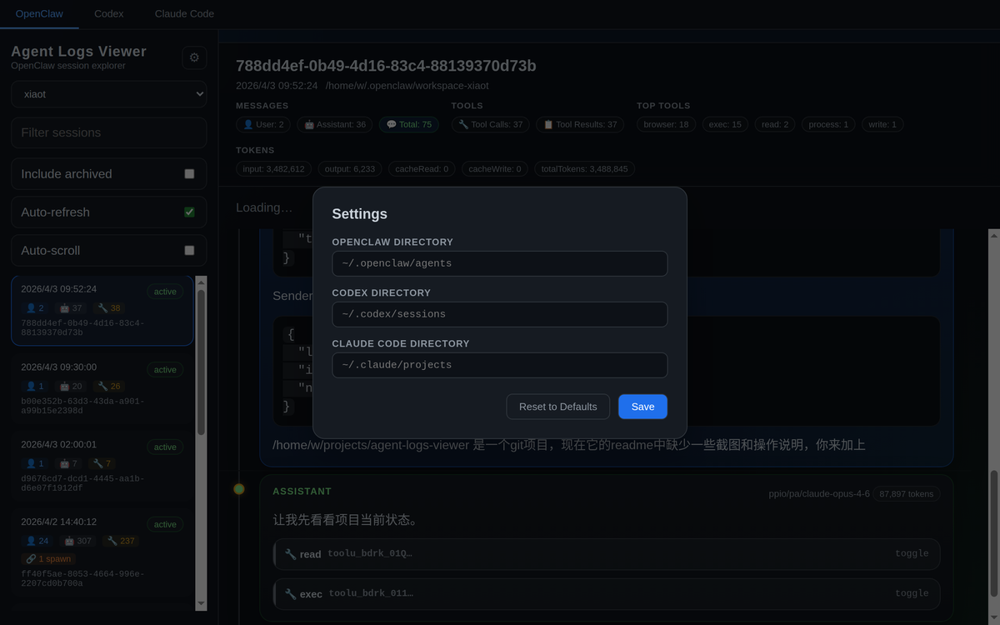

# Agent Logs Viewer

多平台 AI Agent 日志查看面板，支持 **OpenClaw**、**Codex** 和 **Claude Code**。

[English](README.md) | 中文



## 功能特性

- **多平台支持** — 一个界面统一查看 OpenClaw、Codex、Claude Code 的会话日志
- **会话浏览** — 浏览 Agent 列表，搜索/过滤会话，查看消息历史
- **工具调用检查** — 可展开的工具调用详情，包含参数和返回结果
- **Spawn 追踪** — 检测并导航父子 Agent 之间的调用关系
- **消息时间线** — 可视化对话流程图，不同角色用不同颜色标识
- **自动刷新** — 会话列表和消息实时更新
- **设置面板** — 在页面上直接配置各平台目录，保存到 localStorage，无需重启
- **键盘导航** — 使用方向键在会话之间切换

## 截图预览

### 会话浏览

侧边栏浏览 Agent 和会话列表。每个会话卡片显示按角色分类的消息数（👤 用户、🤖 助手、🔧 工具）和 spawn 标记。主面板展示会话元数据、Token 用量和热门工具概览。


### 工具调用检查

展开任意工具调用可查看其参数和返回结果。折叠状态下按工具类型显示调用次数，方便快速扫视。



### Spawn 追踪

含有子 Agent 的会话会标注 🔗 徽章。点击可导航父子 Agent 调用链。



### 多平台支持

一键切换 OpenClaw、Codex、Claude Code。每个平台的会话均从其原生日志格式解析。



### 设置面板

在页面上配置各平台目录，保存到 localStorage，无需重启服务。



## 快速开始

```bash
git clone https://github.com/alloevil/agent-logs-viewer.git
cd agent-logs-viewer
npm install
npm start
```

打开 http://localhost:3800

## 使用方法

### 基本流程

1. **选择平台** — 点击顶部 `OpenClaw`、`Codex` 或 `Claude Code`
2. **选择 Agent** — OpenClaw 平台下，从下拉菜单选择 Agent（如 `xiaot`、`mimo`）
3. **浏览会话** — 会话按时间倒序排列，每张卡片显示：
   - 时间戳和状态（`active` / `archived`）
   - 消息计数：👤 用户、🤖 助手、🔧 工具调用
   - 🔗 Spawn 标记（如果该会话产生了子 Agent）
4. **查看消息** — 点击会话加载完整对话
5. **检查工具调用** — 点击 `🔧 tool_name` 按钮展开参数/结果
6. **导航 Spawn** — 点击 🔗 链接跳转到子 Agent 会话

### 键盘快捷键

| 按键 | 操作 |
|------|------|
| `↑` / `↓` | 在会话间切换 |
| `Enter` | 选中高亮的会话 |

### 过滤与搜索

- **搜索框** — 按 ID 或内容过滤会话
- **包含已归档** — 切换显示/隐藏已归档（`.reset.*` / `.deleted.*`）会话
- **自动刷新** — 自动轮询获取新会话和消息
- **自动滚动** — 新内容到达时自动滚动到最新消息

## 配置

### 默认目录

| 平台        | 默认路径                      |
|-------------|-------------------------------|
| OpenClaw    | `~/.openclaw/agents`          |
| Codex       | `~/.codex/sessions`           |
| Claude Code | `~/.claude/projects`          |

### 自定义目录

**通过页面设置：** 点击侧边栏的齿轮图标，为每个平台设置自定义路径。保存到 localStorage，无需重启服务。

**通过环境变量：**

```bash
OPENCLAW_DIR=/custom/path/openclaw \
CODEX_DIR=/custom/path/codex \
CLAUDE_CODE_DIR=/custom/path/claude \
npm start
```

**通过 API：** 在任意 API 请求后附加 `?dir=/absolute/path` 参数。

## API

| 接口 | 说明 |
|------|------|
| `GET /api/agents` | 获取 OpenClaw Agent 列表 |
| `GET /api/agents/:name/sessions` | 获取指定 Agent 的会话列表 |
| `GET /api/agents/:name/sessions/:id` | 获取会话消息详情 |
| `GET /api/codex/sessions` | 获取 Codex 会话列表 |
| `GET /api/codex/sessions/:id` | 获取 Codex 会话消息详情 |
| `GET /api/claude-code/sessions` | 获取 Claude Code 会话列表 |
| `GET /api/claude-code/sessions/:id` | 获取 Claude Code 会话消息详情 |
| `GET /api/spawn-map` | 获取 Agent spawn 关系图 |

所有列表和详情接口均支持 `?dir=` 参数来覆盖默认目录。

## 技术栈

- **后端：** Node.js + Express
- **前端：** 单文件 HTML/CSS/JS（~70KB，无构建步骤，无框架依赖）
- **数据：** 直接从磁盘读取 JSONL 会话文件
- **零外部 CDN** — 完全自包含，离线可用

## 支持的日志格式

| 平台 | 格式 | 路径模式 |
|------|------|----------|
| OpenClaw | JSONL | `~/.openclaw/agents/{agent}/sessions/{id}.jsonl` |
| Codex | JSONL | `~/.codex/sessions/{id}.jsonl` |
| Claude Code | JSONL | `~/.claude/projects/*/sessions/*/session.jsonl` |

启用“包含已归档”后，还会显示 `.jsonl.reset.*` 和 `.jsonl.deleted.*` 的归档会话。

## 开源协议

MIT
